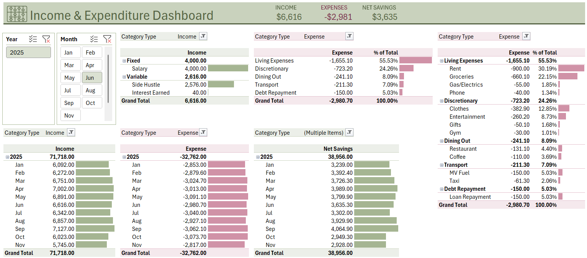

# 💰 Personal Finance Tracker – Excel Dashboard

A smart, self-updating Excel dashboard that helps individuals take control of their personal finances. Track income and expenses, monitor savings, and uncover spending habits—all in one intuitive, visual tool.

---

## 🎯 Objective

To create a **user-friendly, Excel-based personal finance dashboard** that allows individuals to:

- Log and categorize transactions easily
- Visualize their income vs. spending trends
- Identify financial leaks and saving opportunities
- Make informed budgeting decisions month-over-month

---

## 🧠 Why This Project?

Most finance tracking apps are either too complex or hide their logic. This project:
- Is **transparent** in logic and flow
- Uses **Excel only**—no plugins, no VBA
- Shows how **data analytics skills** can simplify everyday decisions

---

## 🛠️ Features

✅ **Automated Transaction Categorization**  
Link raw transaction data with predefined categories and subcategories using lookup logic and filters.

✅ **Interactive Income vs Expense Dashboard**  
A visual summary with monthly aggregates, category breakdowns, and pivot charts for deep insights.

✅ **Customizable Categories**  
Use the `Categories` sheet to tailor your own expense and income types—ideal for personal flexibility.

✅ **Monthly Data Templates**  
Each month has its own transaction sheet (like `Nov Data`) to ensure clean inputs and easy monthly comparisons.

✅ **Bank Transaction Import Support**  
Designed to mirror how most online banking data is exported (columns like Account, Date, Description, Debit, Credit).

---

## 📊 Key Insights You Can Gain

- **Spending Distribution:** Which categories consume the most money (e.g., food, subscriptions)?
- **Saving Rate:** How much of your income are you able to retain each month?
- **Income Streams:** A breakdown of your active and passive income channels.
- **Financial Health Check:** Are your expenses consistently higher than income?
- **Seasonal Trends:** Are there any high-expense months to plan for?

---

## 🔎 How It Works

1. **Update the `Bank Transactions` sheet** with new entries.
2. Data flows automatically into the dashboard through formulas and pivot tables.
3. Dashboard in `Report` sheet updates in real-time—no macros or coding needed.
4. Use `Nov Data` sheet as a template to maintain monthly data for analysis.

---

## 🚀 Applications

- **Portfolio piece** for aspiring data analysts to showcase Excel proficiency
- **Personal use** to track and optimize your finances
- **Educational tool** to teach others how to apply data analysis in real life

---

## 📈 Future Enhancements

- ✅ Add conditional formatting for overspending alerts
- ✅ Monthly budget input vs actual comparison
- ❌ Power BI or Google Sheets version *(planned)*
- ❌ Multi-currency tracking

---

## 📬 Want to Collaborate or Get a Copy?

Feel free to fork this repo, suggest improvements, or reach out for customized templates.

